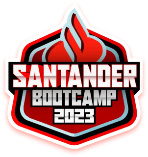

 
    
    

### UM POUCO SOBRE MIM:

    

### 🏢 Formação Acadêmica e Profissional:

🎓 Graduado em Administração pela Universidade Cidade de São Paulo.

📉 Em transição de carreira para a área de Inteligência de Negócios.

💼 Experiência em processos administrativos, aplicando habilidades de análise e gestão.

### 🎯  Foco e Especializações:

🥇 Certificado Profissional do Google Data Analytics (conquistado em 2022).

📚 Especialização em Business Intelligence e Analytics pela Universidade Anhembi Morumbi.

    🏆 Bootcamps e Treinamentos:  
       
    
      
    
    
    
    

 

### 🔧 Habilidades Técnicas:

Power BI: Criação de dashboards interativos e relatórios visuais para tomada de decisão.
Análise de Dados: Proficiência em técnicas de análise estatística e interpretação de dados.
Ferramentas de BI: Experiência com ferramentas como SQL, Excel, Python, R e Power BI .

### 🚀 Objetivo de Carreira:

Transformar dados em insights acionáveis para otimizar processos empresariais e contribuir para a tomada de decisões estratégicas.

### 🌐 Projetos e Contribuições:

Participação em diversos projetos de BI, desenvolvendo soluções que melhoraram significativamente a eficiência operacional.
Contribuições para a comunidade de dados através de tutoriais e compartilhamento de conhecimento sobre melhores práticas em análise de dados.

 

    
    
        </a>
    
        </a>
    
        </a>
    
        </a>
    
        </a>
    
        </a>
    
        </a>
    
        </a>
    
        </a>
    
        

 

### 📈 Interesse Contínuo:

Apaixonado por explorar novas tecnologias e metodologias na área de Business Intelligence.
Engajado em aprimorar continuamente minhas habilidades e conhecimentos para acompanhar as tendências do mercado de dados.

    

 

## Portfólio em BI:

## Principais Projetos

## Tecnologias

 
    
    
    
    
    
    
    
    
    
    

 

## Contatos:

