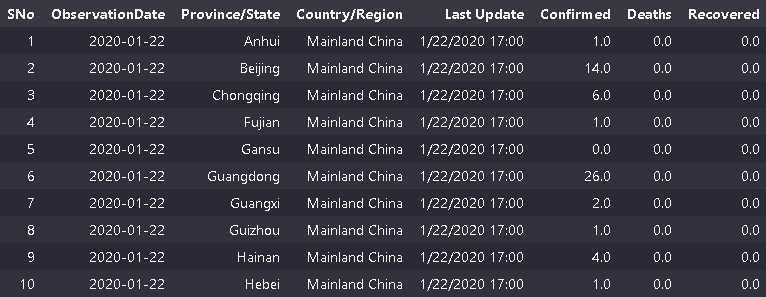
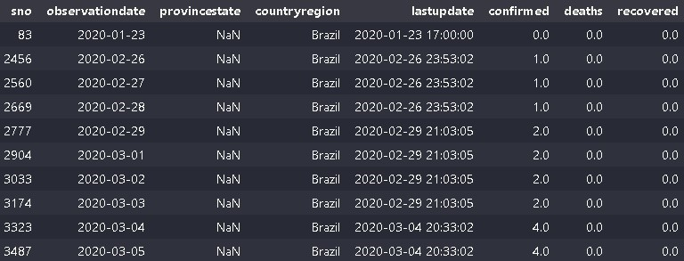
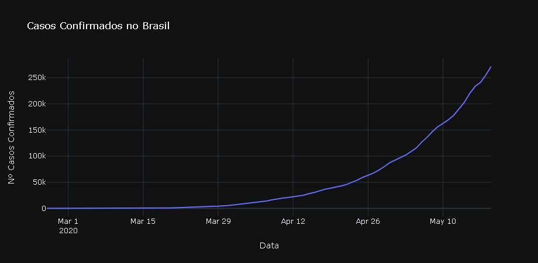
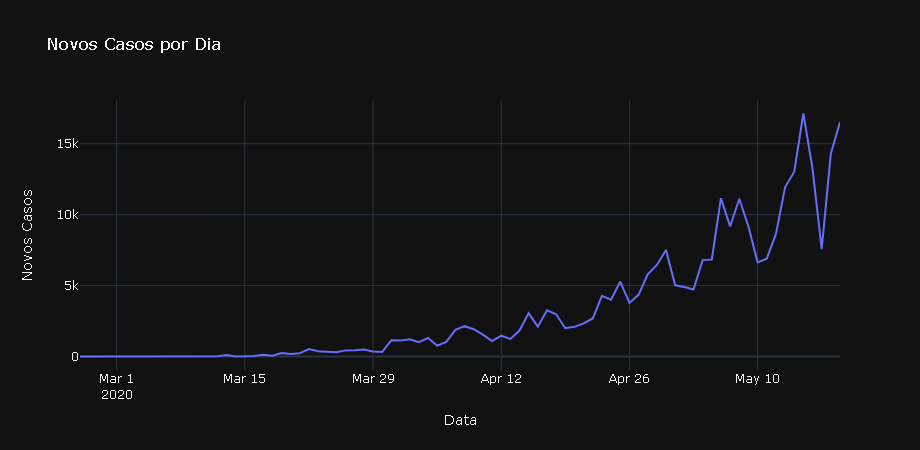
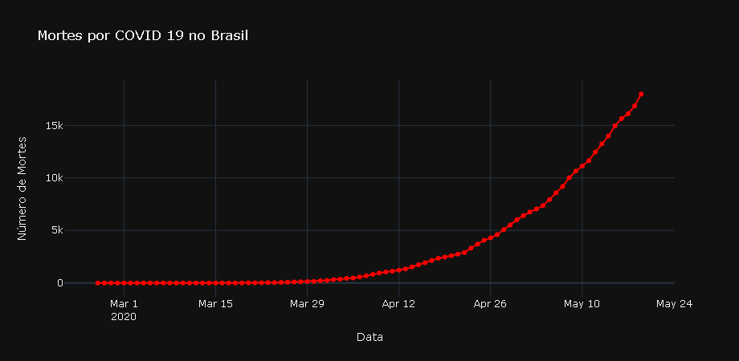
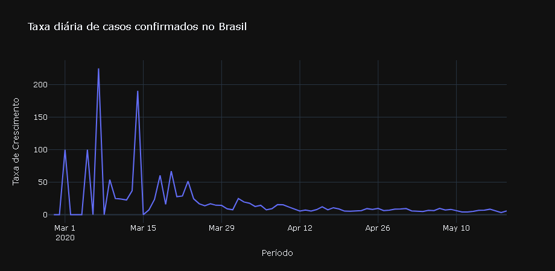

<h1>Desafio de Projeto:  Ciência de Dados com Python </h1>

#   Criando Modelos de Previsão para Análise da Evolução do COVID-19 no Brasil 👨‍⚕️📈

## Entendendo o desafio
A pandemia da COVID-19 teve um impacto significativo em todo o mundo, incluindo no Brasil. A capacidade de prever a evolução da doença é crucial para a implementação de medidas preventivas e alocar recursos de forma eficiente.

 

<strong>Definição do Objetivo: </strong>Você é um cientista de dados contratado para um projeto de Machine Learning com o objetivo de criar um modelo de previsão utilizando Python para analisar e estimar a evolução da COVID-19 no Brasil. O intuito é fornecer insights valiosos sobre possíveis tendências futuras dos casos de COVID 19 no Brasil com base nos dados históricos disponíveis.

#### Fundamentos Utilizados:

- Estruturas Lógicas e Condicionais;
- Variáveis e tipos de dados;
- Gráficos;
- Funções e;
- Machine Learning.
 

### Etapas do Desafio:
#

1. <strong>Coleta e Preparação dos Dados:</strong>
    
     
    
    - <strong>Dados Disponíveis: </strong>Os dados necessários para este projeto podem ser obtidos a partir de fontes confiáveis, como órgãos de saúde pública, instituições governamentais ou repositórios online. A coleta dos dados utilizados neste projeto foi realizado de um arquivo CSV na plataforma de competições Kaggle, disponível em: https://www.kaggle.com/datasets/sudalairajkumar/novel-corona-virus-2019-dataset

      

    <h5 align = "center"> 
    
    
  <strong>Imagem:</strong> Amostra da base dados.

    </h5>
    
     

    
    - <strong>Pré-Processamento: </strong>Após a obtenção dos dados é necessário garantir que os dados estejam prontos para a análise e livres de ruídos, inconsistências e redundâncias. Visando a qualidade dos dados a serem analisados. Com isso, foi necessário conferir se os tipos de dados estavam corretos, assegurar que os nomes das colunas estivessem sem caracteres especiais e letras maiúsculas, filtrados por país, neste caso o Brasil. Importante observar que os dados do país não apresentam informações a nível de estado e região, somente em nível nacional.

    <h5 align = "center"> 
        
        
  <strong>Imagem:</strong> Amostra dos dados tratados.

        </h5>
        
     

2. <strong>Análise Exploratória dos Dados: </strong>Oportunidade de realizar uma análise exploratória para compreender a distribuição dos casos, identificar padrões sazonais e examinar correlações entre diferentes variáveis.
    
    - <strong>Casos Confirmados: </strong> Podemos analisar a evolução dos casos confirmados no Brasil ao longo do tempo que apresentaram uma taxa de crescimento médio de 16,27% no período avaliado. 

    <h5 align = "center"> 
        
        
  <strong>Imagem:</strong> Evolução de Casos Confirmados.

        </h5>
        
     

    - <strong>Número de Casos por Dia: </strong> Na análise anterior é possível visualizar o crescimento exponencial de casos apartir de Abril de 2020, contudo, o número de casos por dia apresenta uma visão um pouco mais preocupante dos picos de novos casos da doença.
    
    <h5 align = "center"> 
        
        
  <strong>Imagem:</strong> Evolução de Novos Casos por Dia.

    </h5>
        
     

    - <strong>Número de Mortes: </strong> Agora, podemos visualizar o crescimento no número de mortes ao longo do tempo ocasionado pela doença. Como esperado, o aumento no número de mortes resultante do crescimento de casos confimrados da doença.
    
    <h5 align = "center"> 
        
        
  <strong>Imagem:</strong> Número de Mortes por COVID 19.

    </h5>

     

    - <strong>Taxa de Crescimento de Casos de COVID 19 no Brasil: </strong> É possível analisarmos que no período que se iniciou o proliferação da doença houve um crescimento percentual diário, exponencial de casos e que ao decorrer do período houve uma estabilização no valor percentual de casos,porém apresentando que o contágio da doença continua evoluindo ao decorrer do período. 
    <h5 align = "center"> 
        
        
  <strong>Imagem:</strong> Taxa de Crescimento dos Casos de COVID 19.

    </h5>

     

3. <strong>Desenvolvimento do Modelo de Previsão: </strong> Vamos iniciar construindo um modelo de séries temporais para prever novos casos de COVID 19:

#
### Conclusão:

Este projeto conclui com êxito seu objetivo de desenvolver um modelo de previsão utilizando Python, oferecendo uma oportunidade valiosa para contribuir no entendimento da dinâmica da COVID-19 no Brasil e podendo ser adaptado e aprimorado com o tempo, incorporando novos dados e métodos de modelagem conforme necessário, visando garantir que a interpretação e comunicação dos resultados sejam feitas de maneira ética, evitando alarmismo e promovendo a conscientização sobre a importância das medidas preventivas com base em dados.
#

### Códigos:

       

#
### Contato:

    
  

